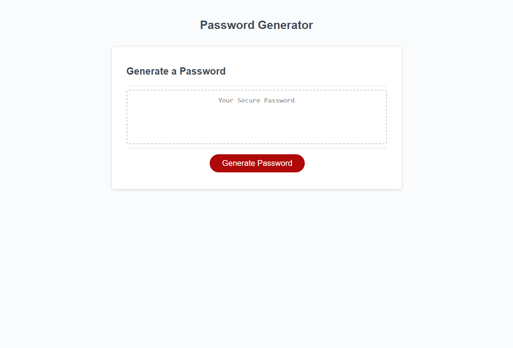

# Password Generator

## Description
This project is a password generator that creates a strong and secure password for users who need access to sensitive data. The user can specify the length of the password and which character types to include, such as lowercase letters, uppercase letters, numbers, and special characters. The generated password is then displayed on the page.

## Installation
No installation is required for this project. 

## Usage
To use the password generator, click on the "Generate Password" button on the page. The generator will then prompt you to select the desired length of the password and which character types to include. Once you have made your selections, the generator will create a strong, randomly generated password that meets your criteria.

## Credits
This project was created by Joel Cupeles as part of a programming assignment.

## License
This project is licensed under the MIT License.

## Features
1. Random password generation
2. Customizable password length
3. Character type selection

## Links
 